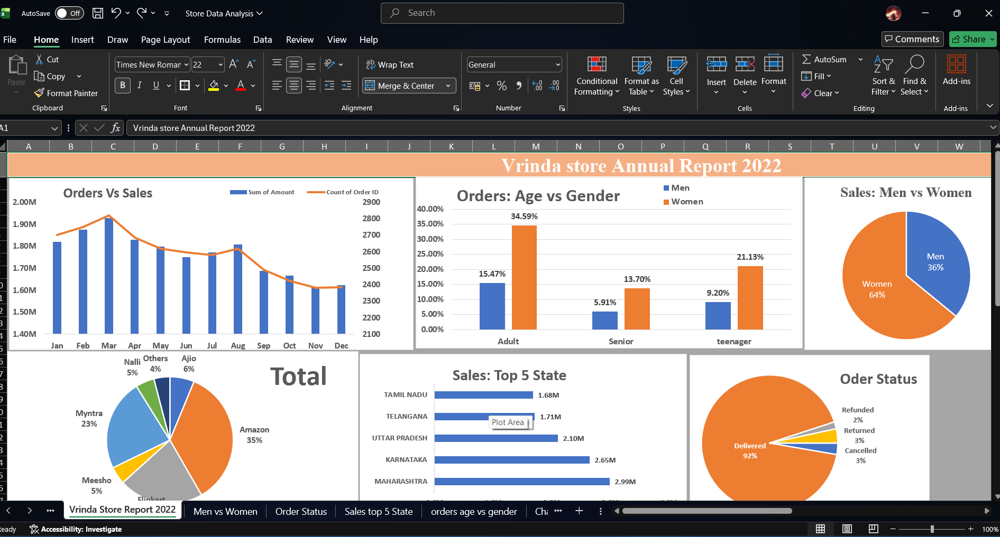

# Store Annual Report 2022 - Data Analysis

## 📊 Overview
This project presents an end-to-end data analysis and interactive dashboard for Vrinda Store's 2022 performance using Microsoft Excel. It analyzes sales trends, customer demographics, order status, and top channels to provide actionable business insights.

---

## 📷 Dashboard Preview

---

## 🔍 Key Insights
- **Sales vs Orders:** Peak sales were recorded in March 2022 (~1.92M) with around 2,800 orders.
- **Demographics:** Women account for **64%** of total sales, with adult women (34.59%) being the largest purchasing demographic.
- **Top Channels:** Amazon leads channel sales with **35%**, followed by Myntra (**23%**).
- **Top States:** Maharashtra (**2.99M**), Karnataka (**2.65M**), and Uttar Pradesh (**2.10M**) generated the highest revenue.
- **Order Fulfillment:** **92%** of total orders were successfully delivered.

---

## 📁 Repository Structure
- `Store Data Analysis.xlsx` - Main Excel file containing dataset, pivot tables, and dashboard.
- `dashboard_screenshot.png.png` - Dashboard image preview.
- `README.md` - Project documentation.

---

## 🛠️ Tools Used
- **Data Cleaning & Processing:** Microsoft Excel
- **Data Visualization:** Excel Charts & Interactive Dashboard
